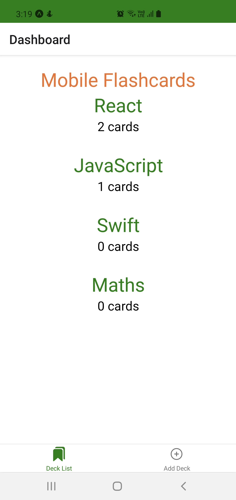
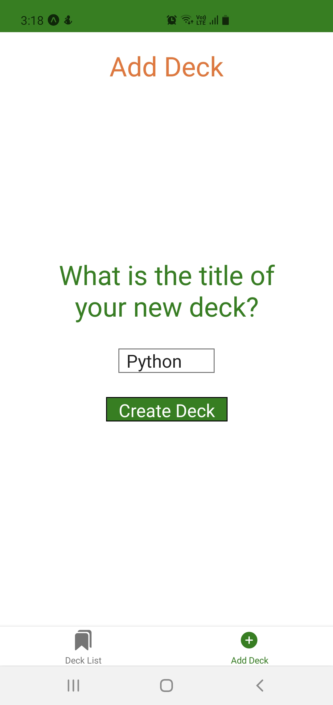
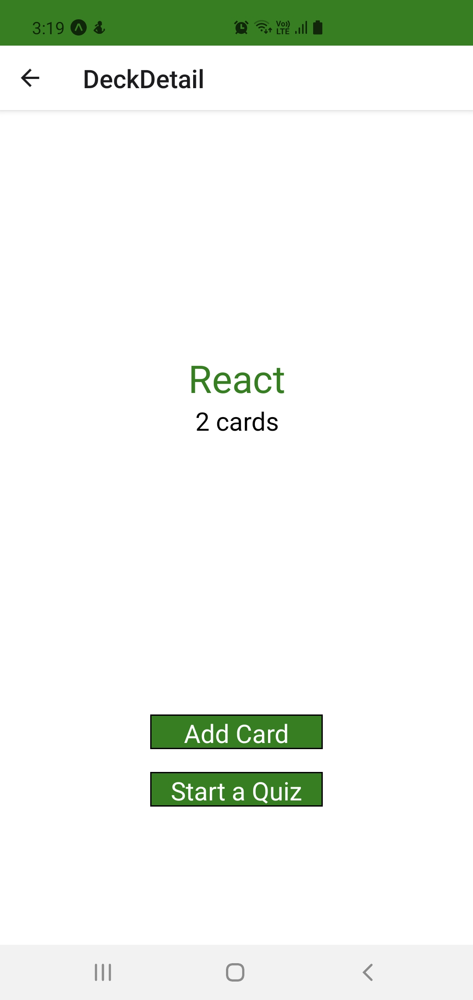
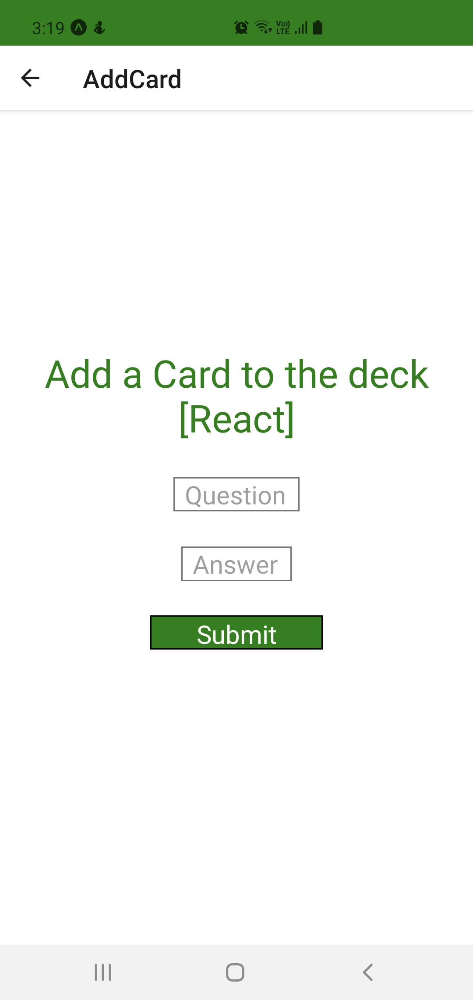
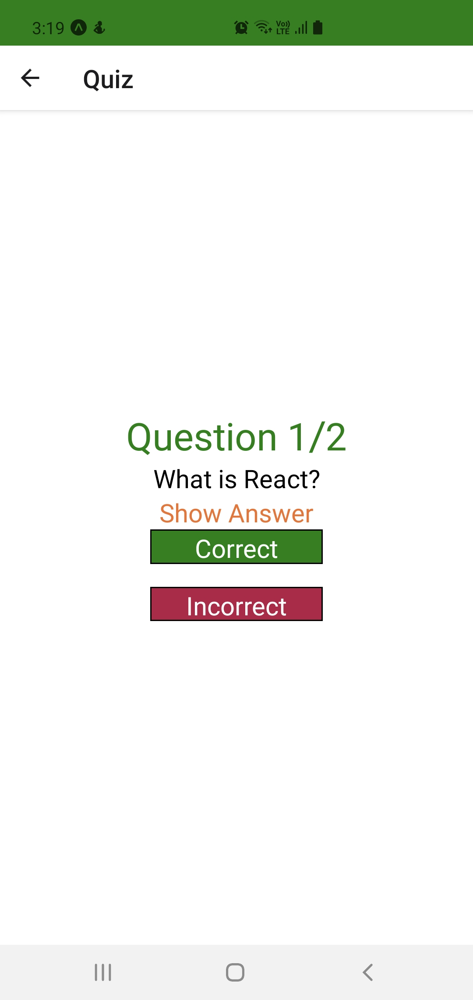

# Mobile Flashcards React Native App
## Project Overview
Mobile Flashcards is a React Native app developed for both Android and iOS platform that let users to study collections of flashcards. The app allow users to create different categories of flashcards called "decks", add flashcards to those decks, then take quizzes on those decks.
## Application Functionality
* the app allow users to create a deck which can hold an unlimited number of cards
* the app allow users to add a card to a specific deck
* the front of the card should display the question
* the back of the card should display the answer
* users should be able to quiz themselves on a specific deck and receive a score once they're done
* users should receive a notification to remind themselves to study if they haven't already for that day

## Create React Native App (CRNA)
This project was bootstrapped with [Create React Native App](https://github.com/expo/create-react-native-app)
## Project dependencies
Project dependencies can be referenced from [`package.json`](package.json)
### Installation and usage
In the project directory, you can run the below scripts:
* install all project dependencies either with `yarn install` or `npm install`
* start the app either with `npm start` or `yarn start`
    Note this will open Expo developer tools in the browser.
### Launching the app:
There are different approaches to launch the app as described below:
* scan the QR code with Expo Client App to launch the Flashcards app on your mobile device
    - [Expo Go on Google Play (Android)](https://play.google.com/store/apps/details?id=host.exp.exponent) or 
    - [Expo on the App Store (iOS)](https://apps.apple.com/us/app/expo-client/id982107779)  
* you can also use Android or iOS simulator to run the app on your computer
    - [Android Emulator Setup](https://docs.expo.io/workflow/android-studio-emulator/) or 
    - [iOS Simulator SetUp](https://docs.expo.io/workflow/ios-simulator/)
### Additional information on how to build package file
* Install [Expo CLI](https://docs.expo.io/get-started/installation/)
* run `exp build:android` to build the .apk (Android Application Package) file
* run `exp build:ios` to build the .ipa (iOS App Store Package) file
* to check build status run `exp build:status` 
## Technologies used
* `react-native`
* `redux`
* `react-navigation`
* `expo`
## Platforms tested
The developed code have been tested using Expo Go App on Android Version 11
## Application views
* `Deck List View (Default View)`
    - displays the title of each Deck
    - displays the number of cards in each deck
* `New Deck View`
    - An option to enter in the title for the new deck
    - An option to submit the new deck title
* `Deck View`
    - displays the title of the Deck
    - displays the number of cards in the deck
    - displays an option to start a quiz on this specific deck
    - An option to add a new question to the deck
* `New Question View`
    - An option to enter in the question
    - An option to enter in the answer
    - An option to submit the new question
* `Quiz View`
    - displays a card question
    - an option to view the answer (flips the card)
    - a "Correct" button
    - an "Incorrect" button
    - the number of cards left in the quiz
    - displays the percentage correct once the quiz is complete
## Backend server
The App leverages the [`api.js`](./utils/api.js) which serves as a backend server 
and provides the following helper methods to manage AsyncStorage database:

* `getDecks`: return all of the decks along with their titles, questions, and answers.
* `getDeck`: take in a single `id` argument and return the deck associated with that id.
* `saveDeckTitle`: take in a single `title` argument and add it to the decks.
* `addCardToDeck`: take in two arguments, `title` and `card`, and will add the card to the list of questions for the deck with the associated title.

## Application screen
1. **App Home screen**
{:height="700px" width="400px"}
2. **Add Deck screen**

3. **Deck Detail View screen**

4. **Add Card screen**

5. **Quiz View screen**

## Author
Sayantani Chaudhuri